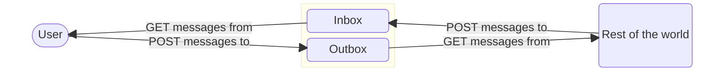
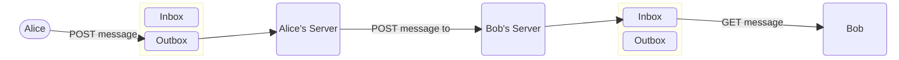

# ActivityPub

- [ActivityPub](#activitypub)
  - [Objects](#objects)
    - [Retrieving objects](#retrieving-objects)
    - [Source](#source)
  - [Actors](#actors)
    - [Inbox and Outbox](#inbox-and-outbox)
  - [Activity Streams](#activity-streams)
    - [Public collections](#public-collections)
  - [Protocol](#protocol)
  - [Social API](#social-api)
    - [Client Addressing](#client-addressing)
    - [Create Activity](#create-activity)
    - [Update Activity](#update-activity)
    - [Delete Activity](#delete-activity)
    - [Follow Activity](#follow-activity)
    - [Add Activity](#add-activity)
    - [Remove Activity](#remove-activity)
    - [Like Activity](#like-activity)
    - [Block Activity](#block-activity)
    - [Undo Activity](#undo-activity)
    - [Delivery](#delivery)
  - [Federation Protocol](#federation-protocol)
    - [Server Side Activities](#server-side-activities)
  - [Mastodon](#mastodon)
    - [Statuses Federation](#statuses-federation)
      - [Payloads](#payloads)
      - [HTML Sanitization](#html-sanitization)
      - [Status Properties](#status-properties)
      - [Poll specific properties](#poll-specific-properties)
    - [Profiles Federation](#profiles-federation)
      - [Profile Properties](#profile-properties)
    - [Reports Extension](#reports-extension)
    - [Sensitive Extension](#sensitive-extension)
    - [Hashtag](#hashtag)
    - [Custom Emoji](#custom-emoji)
    - [Quote Posts](#quote-posts)
    - [Polls](#polls)
    - [Mentions](#mentions)
    - [Blurhash](#blurhash)
    - [Reports](#reports)
    - [Featured Collection](#featured-collection)
    - [Identity Proofs](#identity-proofs)
    - [Profile Metadata](#profile-metadata)
    - [Account Migration](#account-migration)
    - [Remote Blocking](#remote-blocking)

This module provides a technical overview with simple diagrams of the ActivityPub protocol, which is used for federated social networking.

The diagrams illustrate the flow of activities between actors in a federated network, showing how they interact with each other through various endpoints, and so what it has to be implemented in order to support ActivityPub on Mastic.

## Objects

All objects in ActivityPub are represented as JSON-LD documents. The objects can be of various types, such as `Person`, `Note`, `Create`, `Like`, etc.

Each object MUST have:

- `id`: The object's unique global identifier (unless the object is transient, in which case the id MAY be omitted).
- `type`: The type of the object.

and can have various properties such as `to`, `actor`, and `content`.

### Retrieving objects

Servers MUST present the ActivityStreams object representation in response to `application/ld+json; profile="https://www.w3.org/ns/activitystreams"`, and SHOULD also present the ActivityStreams representation in response to `application/activity+json` as well.

The client MUST specify an Accept header with the `application/ld+json; profile="https://www.w3.org/ns/activitystreams"` media type in order to retrieve the activity.

### Source

The Object also contains the source attribute, which has been originally used to derive the `content`:

```json
{
  "content": "<p>I <em>really</em> like strawberries!</p>",
  "source": {
    "content": "I *really* like strawberries!",
    "mediaType": "text/markdown"
    }
}
```

## Actors

Actors are the entities that perform actions in the ActivityPub protocol. They can be users, applications, or services. Each actor has a unique identifier and can have various properties such as name, icon, and preferred language.

Actors are represented as JSON-LD documents with the `type` set to `Person`, `Application`, or other types defined in the ActivityStreams vocabulary.

Each actor MUST, in addition to the properties for the [Objects](#objects), have the following properties:

- `inbox`: (`OrderedCollection`) The URL of the actor's inbox, where it receives activities.
- `outbox`: (`OrderedCollection`) The URL of the actor's outbox, where it sends activities.
- `following`: (`OrderedCollection`) An Url to an [ActivityStreams](#activity-streams) collection that contains the actors that this actor is following.
- `followers`: (`OrderedCollection`) An Url to an [ActivityStreams](#activity-streams) collection that contains the actors that are following this actor.
- `liked`: (`OrderedCollection`) An Url to an [ActivityStreams](#activity-streams) collection that contains the activities that this actor has liked.

```json
```json
{
  "@context": ["https://www.w3.org/ns/activitystreams", { "@language": "ja" }],
  "type": "Person",
  "id": "https://kenzoishii.example.com/",
  "following": "https://kenzoishii.example.com/following.json",
  "followers": "https://kenzoishii.example.com/followers.json",
  "liked": "https://kenzoishii.example.com/liked.json",
  "inbox": "https://kenzoishii.example.com/inbox.json",
  "outbox": "https://kenzoishii.example.com/feed.json",
  "preferredUsername": "kenzoishii",
  "name": "石井健蔵",
  "summary": "この方はただの例です",
  "icon": ["https://kenzoishii.example.com/image/165987aklre4"]
}
```

### Inbox and Outbox

Every actor has both an inbox and an outbox. The inbox is where the actor receives activities from other actors, while the outbox is where the actor sends activities to other actors.

From an implementation perspective, both the Inbox and the Outbox, are `OrderedCollection` objects.



Actor data:

```json
{
  "@context": "https://www.w3.org/ns/activitystreams",
  "type": "Person",
  "id": "https://social.example/alice/",
  "name": "alice P. Hacker",
  "preferredUsername": "alice",
  "summary": "Lisp enthusiast hailing from MIT",
  "inbox": "https://social.example/alice/inbox/",
  "outbox": "https://social.example/alice/outbox/",
  "followers": "https://social.example/alice/followers/",
  "following": "https://social.example/alice/following/",
  "liked": "https://social.example/alice/liked/"
}
```

Now let's say Alice wants to send a message to Bob. The following diagram illustrates the flow of this activity:



First Alice sends a message to her outbox:

```json
{
  "@context": "https://www.w3.org/ns/activitystreams",
  "type": "Note",
  "to": ["https://chatty.example/ben/"],
  "attributedTo": "https://social.example/alice/",
  "content": "Say, did you finish reading that book I lent you?"
}
```

Then Alice's server creates the post and forwards the message to Bob's server:

```json
{
  "@context": "https://www.w3.org/ns/activitystreams",
  "type": "Create",
  "id": "https://social.example/alice/posts/a29a6843-9feb-4c74-a7f7-081b9c9201d3",
  "to": ["https://chatty.example/ben/"],
  "actor": "https://social.example/alice/",
  "object": {
    "type": "Note",
    "id": "https://social.example/alice/posts/49e2d03d-b53a-4c4c-a95c-94a6abf45a19",
    "attributedTo": "https://social.example/alice/",
    "to": ["https://chatty.example/ben/"],
    "content": "Say, did you finish reading that book I lent you?"
  }
}
```

Later after Bob has answered, Alice can fetch her inbox with a GET and see the answer to that message:

```json
{
  "@context": "https://www.w3.org/ns/activitystreams",
  "type": "Create",
  "id": "https://chatty.example/ben/p/51086",
  "to": ["https://social.example/alice/"],
  "actor": "https://chatty.example/ben/",
  "object": {
    "type": "Note",
    "id": "https://chatty.example/ben/p/51085",
    "attributedTo": "https://chatty.example/ben/",
    "to": ["https://social.example/alice/"],
    "inReplyTo": "https://social.example/alice/posts/49e2d03d-b53a-4c4c-a95c-94a6abf45a19",
    "content": "<p>Argh, yeah, sorry, I'll get it back to you tomorrow.</p><p>I was reviewing the section on register machines,since it's been a while since I wrote one.</p>"
  }
}
```

Further interactions can be made, such as liking the reply:

```json
{
  "@context": "https://www.w3.org/ns/activitystreams",
  "type": "Like",
  "id": "https://social.example/alice/posts/5312e10e-5110-42e5-a09b-934882b3ecec",
  "to": ["https://chatty.example/ben/"],
  "actor": "https://social.example/alice/",
  "object": "https://chatty.example/ben/p/51086"
}
```

And this will follow the same flow as before.

## Activity Streams

```json
{
  "@context": "https://www.w3.org/ns/activitystreams",
  "id": "https://www.w3.org/ns/activitystreams",
  "type": "Collection"
}
```

ActivityStreams defines the collection concept; ActivityPub defines several collections with special behavior. Note that ActivityPub makes use of ActivityStreams paging to traverse large sets of objects.

> Note that some of these collections are specified to be of type `OrderedCollection` specifically, while others are permitted to be either a `Collection` or an `OrderedCollection`. An `OrderedCollection` MUST be presented consistently in reverse chronological order.

### Public collections

Some collections are marked as `Public`

```json
{
  "@context": "https://www.w3.org/ns/activitystreams",
  "id": "https://www.w3.org/ns/activitystreams#Public",
  "type": "Collection"
}
```

And MUST be accessible to anyone, regardless of whether they are authenticated or not.

## Protocol

The protocol is based on HTTP and uses JSON-LD for data representation.

Two APIs are defined:

- **Social API**: It's a client-to-server API that allows clients to interact with the server, such as creating posts, following users, and liking content.
- **Federation Protocol**: It's a server-to-server API that allows servers to exchange activities with each other, such as sending posts, following users, and liking content.

Mastic is implemented as a **ActivityPub conformant Federated Server**, with a significant variation.

While the Federation Protocol is implemented with HTTP, the Social API is implemented using the Internet Computer's native capabilities, such as `update` calls and `query` calls, and calls are so authenticated using the [Internet Computer's Internet Identity](https://internetcomputer.org/internet-identity).

## Social API

Client to server interaction takes place through clients posting `Activities` to an **actor's outbox**.

To do this, clients MUST discover the URL of the actor's outbox from their profile and then MUST make an Update request passing this URL to the `url` argument.

The request MUST be authenticated with the credentials of the user to whom the outbox belongs.

The query and update calls take two arguments:

- `url`: the URL of the object the user wants to interact with; this works basically in the same way of the URL on the HTTP Social API.
- `payload`: the payload using the ActivityPub data payload Candid encoded.

The body of the POST request MUST contain a single Activity (which MAY contain embedded objects), or a single non-Activity object which will be wrapped in a Create activity by the server.

```json
{
  "@context": ["https://www.w3.org/ns/activitystreams", { "@language": "en" }],
  "type": "Like",
  "actor": "https://dustycloud.org/chris/",
  "name": "Chris liked 'Minimal ActivityPub update client'",
  "object": "https://rhiaro.co.uk/2016/05/minimal-activitypub",
  "to": [
    "https://rhiaro.co.uk/#amy",
    "https://dustycloud.org/followers",
    "https://rhiaro.co.uk/followers/"
  ],
  "cc": "https://e14n.com/evan"
}

```

If an Activity is submitted with a value in the id property, servers MUST ignore this and generate a new id for the Activity.

The server MUST remove the bto and/or bcc properties, if they exist, from the ActivityStreams object before delivery, but MUST utilize the addressing originally stored on the bto / bcc properties for determining recipients in delivery.

The server MUST then add this new Activity to the outbox collection. Depending on the type of Activity, servers may then be required to carry out further side effects. (However, there is no guarantee that time the Activity may appear in the outbox. The Activity might appear after a delay or disappear at any period). These are described per individual Activity below.

Attempts to submit objects to servers not implementing client to server support SHOULD result in a REJECTION.

### Client Addressing

Clients are responsible for addressing new Activities appropriately. To some extent, this is dependent upon the particular client implementation, but clients must be aware that the server will only forward new Activities to addressees in the `to`, `bto`, `cc`, `bcc`, and `audience` fields.

### Create Activity

The `Create` activity is used when posting a new object. This has the side effect that the object embedded within the Activity (in the object property) is created.

When a `Create` activity is posted, the actor of the activity SHOULD be copied onto the object's `attributedTo` field.

For client to server posting, it is possible to submit an object for creation **without a surrounding activity**. The server MUST accept a valid [ActivityStreams](#activity-streams) object that isn't a subtype of Activity in the POST request to the outbox. The server then MUST attach this object as the object of a Create Activity. For non-transient objects, the server MUST attach an id to both the wrapping Create and its wrapped Object.

```json
{
  "@context": "https://www.w3.org/ns/activitystreams",
  "type": "Note",
  "content": "This is a note",
  "published": "2015-02-10T15:04:55Z",
  "to": ["https://example.org/~john/"],
  "cc": ["https://example.com/~erik/followers",
         "https://www.w3.org/ns/activitystreams#Public"]
}
```

Is equivalent to this and both MUST be accepted by the server:

```json
{
  "@context": "https://www.w3.org/ns/activitystreams",
  "type": "Create",
  "id": "https://example.net/~mallory/87374",
  "actor": "https://example.net/~mallory",
  "object": {
    "id": "https://example.com/~mallory/note/72",
    "type": "Note",
    "attributedTo": "https://example.net/~mallory",
    "content": "This is a note",
    "published": "2015-02-10T15:04:55Z",
    "to": ["https://example.org/~john/"],
    "cc": ["https://example.com/~erik/followers",
           "https://www.w3.org/ns/activitystreams#Public"]
  },
  "published": "2015-02-10T15:04:55Z",
  "to": ["https://example.org/~john/"],
  "cc": ["https://example.com/~erik/followers",
         "https://www.w3.org/ns/activitystreams#Public"]
}
```

### Update Activity

The Update activity is used when updating an already existing object. The side effect of this is that the object MUST be modified to reflect the new structure as defined in the update activity, assuming the actor has permission to update this object.

Usually updates are partial.

### Delete Activity

The Delete activity is used to delete an already existing object

The side effect of this is that the server MAY replace the object with a Tombstone of the object that will be displayed in activities which reference the deleted object. If the deleted object is requested the server SHOULD respond with either the `Gone` status code if a Tombstone object is presented as the response body, otherwise respond with a `NotFound`.

```json
{
  "@context": "https://www.w3.org/ns/activitystreams",
  "id": "https://example.com/~alice/note/72",
  "type": "Tombstone",
  "published": "2015-02-10T15:04:55Z",
  "updated": "2015-02-10T15:04:55Z",
  "deleted": "2015-02-10T15:04:55Z"
}
```

### Follow Activity

The Follow activity is used to subscribe to the activities of another actor.

### Add Activity

Upon receipt of an `Add` activity into the outbox, the server SHOULD add the object to the collection specified in the target property, unless:

- the `target` is not owned by the receiving server, and thus they are not authorized to update it.
- the `object` is not allowed to be added to the `target` collection for some other reason, at the receiving server's discretion.

### Remove Activity

Upon receipt of a Remove activity into the outbox, the server SHOULD remove the object from the collection specified in the target property, unless:

- the `target` is not owned by the receiving server, and thus they are not authorized to update it.
- the `object` is not allowed to be removed from the `target` collection for some other reason, at the receiving server's discretion.

### Like Activity

The Like activity indicates the actor likes the object.

The side effect of receiving this in an outbox is that the server SHOULD add the object to the actor's liked Collection.

### Block Activity

The Block activity is used to indicate that the posting actor does not want another actor (defined in the object property) to be able to interact with objects posted by the actor posting the Block activity. The server SHOULD prevent the blocked user from interacting with any object posted by the actor.

Servers SHOULD NOT deliver Block Activities to their object.

### Undo Activity

The Undo activity is used to undo a previous activity. See the Activity Vocabulary documentation on Inverse Activities and "Undo". For example, Undo may be used to undo a previous Like, Follow, or Block. The undo activity and the activity being undone MUST both have the same actor. Side effects should be undone, to the extent possible. For example, if undoing a Like, any counter that had been incremented previously should be decremented appropriately.

There are some exceptions where there is an existing and explicit "inverse activity" which should be used instead. Create based activities should instead use Delete, and Add activities should use Remove.

### Delivery

Federated servers MUST perform delivery on all Activities posted to the outbox according to outbox delivery.

## Federation Protocol

Servers communicate with other servers and propagate information across the social graph by posting activities to actors' inbox endpoints. An **Activity** sent over the network SHOULD have an `id`, unless it is intended to be transient (in which case it MAY omit the id).

POST requests (eg. to the inbox) MUST be made with a `Content-Type` of `application/ld+json; profile="https://www.w3.org/ns/activitystreams"` and GET requests (see also 3.2 Retrieving objects) with an `Accept header` of `application/ld+json; profile="https://www.w3.org/ns/activitystreams"`.

Servers SHOULD interpret a `Content-Type` or `Accept header` of `application/activity+json as equivalent to application/ld+json; profile="https://www.w3.org/ns/activitystreams`" for server-to-server interactions.

In order to propagate updates throughout the social graph, Activities are sent to the appropriate recipients. First, these recipients are determined through following the appropriate links between objects until you reach an actor, and then the Activity is inserted into the actor's inbox (delivery). This allows recipient servers to:

1. conduct any side effects related to the Activity (for example, notification that an actor has liked an object is used to update the object's like count);
2. deliver the Activity to recipients of the original object, to ensure updates are propagated to the whole social graph (see inbox delivery).

Delivery is usually triggered by, for example:

- an Activity being created in an actor's outbox with their Followers Collection as the recipient.
- an Activity being created in an actor's outbox with directly addressed recipients.
- an Activity being created in an actors's outbox with user-curated collections as recipients.
- an Activity being created in an actor's outbox or inbox which references another object.

Servers performing delivery to the `inbox` or `sharedInbox` properties of actors on other servers MUST provide the object property in the activity: `Create`, `Update`, `Delete`, `Follow`, `Add`, `Remove`, `Like`, `Block`, `Undo`. Additionally, servers performing server to server delivery of the following activities MUST also provide the `target` property: `Add`, `Remove`.

An activity is delivered to its targets (which are actors) by first looking up the targets' inboxes and then posting the activity to those inboxes. Targets for delivery are determined by checking the ActivityStreams audience targeting; namely, the `to`, `bto`, `cc`, `bcc`, and `audience` fields of the activity.

### Server Side Activities

Just follow 1:1 the document described here:

<https://www.w3.org/TR/activitypub/#create-activity-inbox>

## Mastodon

### Statuses Federation

In Mastodon statuses are posts, aka _toots_, of the type of `Notes` of the ActivityPub protocol.

Mastodon supports the following activities for `Statuses`:

- `Create`: Transformed into a status and saved into database
- `Delete`: Delete a Status from the database
- `Like`: Favourited a Status
- `Announce`: Boost a status (like rt on Twitter)
- `Undo`: Undo a Like or a Boost
- `Flag`: Transformed into a report to the moderation team. See the [Reports extension](#reports-extension) for more information
- `QuoteRequest`: Request approval for a quote post. See the [Quote Posts extension](#quote-posts)

#### Payloads

The first-class Object types supported by Mastodon are `Note` and `Question`.

- `Notes` are transformed into regular statuses.
- `Questions` are transformed into a poll status. See the [Polls](#polls) extension for more information.

#### HTML Sanitization

<https://docs.joinmastodon.org/spec/activitypub/#sanitization>.

#### Status Properties

These are the properties used:

- `content`: status text content
- `name`: Used as status text, if content is not provided on a transformed Object type
- `summary`: Used as CW (Content warning) text
- `sensitive`: Used to determine whether status media or text should be hidden by default. See the [Sensitive content extension](#sensitive-extension) section for more information about as:sensitive
- `inReplyTo`: Used for threading a status as a reply to another status
- `published`: status published date
- `url`: status permalink
- `attributedTo`: Used to determine the profile which authored the status
- `to/cc`: Used to determine audience and visibility of a status, in combination with mentions. See [Mentions](#mentions) for adddressing and notifications.
- `tag`: Used to mark up mentions and hashtags.
  - `type`: Either Mention, Hashtag, or Emoji is currently supported. See the [Hashtag](#hashtag) and [Custom emoji extension](#custom-emoji) sections for more information.
  - `name`: The plain-text Webfinger address of a profile Mention (`@user` or `@user@domain`), or the plain-text Hashtag (#tag), or the custom Emoji shortcode (`:thounking:`)
  - `href`: The URL of the actor or tag
- `attachment`: Used to include attached images, videos, or audio
  - `url`: Used to fetch the media attachment
  - `summary`: Used as media description `alt`
  - `blurhash`: Used to generate a blurred preview image corresponding to the colors used within the image. See [Blurhash](#blurhash) for more details
- `replies`: A Collection of `statuses` that are in reply to the current status. Up to 5 replies from the same server will be fetched upon discovery of a remote status, in order to resolve threads more fully. On Mastodon’s side, the first page contains self-replies, and additional pages contain replies from other people.
- `likes`: A Collection used to represent Like activities received for this status. The actual activities are not exposed by Mastodon at this time.
  - `totalItems`: The number of likes this status has received
- `shares`: A Collection used to represent Announce activities received for this status. The actual activities are not exposed by Mastodon at this time.
  - `totalItems`: The number of Announce activities received for this status.

#### Poll specific properties

- `endTime`: The timestamp for when voting will close on the poll
- `closed`: The timestamp for when voting closed on the poll. The timestamp will likely match the endTime timestamp. If this property is present, the poll is assumed to be closed.
- `votersCount`: How many people have voted in the poll. Distinct from how many votes have been cast (in the case of multiple-choice polls)
- `oneOf`: Single-choice poll options
  - `name`: The poll option’s text
  - `replies`:
    - `totalItems`: The poll option’s vote count
- `anyOf`: Multiple-choice poll options
  - `name`: The poll option’s text
  - `replies`:
    - `totalItems`: The poll option’s vote count

### Profiles Federation

these are the supported activities for profiles:

- `Follow`: Indicate interest in receiving status updates from a profile.
- `Accept/Reject`: Used to approve or deny Follow activities. Unlocked accounts will automatically reply with an Accept, while locked accounts can manually choose whether to approve or deny a follow request.
- `Add/Remove`: Manage pinned posts and featured collections.
- `Update`: Refresh account details
- `Delete`: Remove an account from the database, as well as all of their statuses.
- `Undo`: Undo a previous Follow, Accept Follow, or Block.
- `Block`: Signal to a remote server that they should hide your profile from that user. Not guaranteed.
- `Flag`: Report a user to their moderation team. See the [Reports extension](#reports) for more information
- `Move`: Migrate followers from one account to another. Requires `alsoKnownAs` to be set on the new account pointing to the old account

#### Profile Properties

- `preferredUsername`: Used for Webfinger lookup. Must be unique on the domain, and must correspond to a Webfinger `acct:` URI.
- `name`: Used as profile display name.
- `summary`: Used as profile bio.
- `type`: Assumed to be `Person`. If type is `Application` or `Service`, it will be interpreted as a bot flag.
- `url`: Used as profile link.
- `icon`: Used as profile avatar.
- `image`: Used as profile header.
- `manuallyApprovesFollowers`: Will be shown as a locked account.
- `discoverable`: Will be shown in the profile directory.
- `indexable`: Posts by this account can be indexed for full-text search
- `publicKey`: Required for signatures
- `featured`: Pinned posts. See [Featured collection](#featured-collection)
- `attachment`: Used for profile fields. See [Profile metadata](#profile-metadata) and [Identity Proofs](#identity-proofs).
- `alsoKnownAs`: Required for `Move` activity
- `published`: When the profile was created.
- `memorial`: Whether the account is a memorial account
- `suspended`: Whether the account is currently suspended
- `attributionDomains`: Domains allowed to use `fediverse:creator` for this actor in published articles.

### Reports Extension

To report profiles and/or posts on remote servers, Mastodon will send a `Flag` activity **from the instance actor**. The **object** of this activity contains the **user being reported**, as well as any posts attached to the report. If a comment is attached to the report, it will be used as the content of the activity.

```json
{
  "@context": "https://www.w3.org/ns/activitystreams",
  "id": "https://mastodon.example/ccb4f39a-506a-490e-9a8c-71831c7713a4",
  "type": "Flag",
  "actor": "https://mastodon.example/actor",
  "content": "Please take a look at this user and their posts",
  "object": [
    "https://example.com/users/1",
    "https://example.com/posts/380590",
    "https://example.com/posts/380591"
  ],
  "to": "https://example.com/users/1"
}
```

### Sensitive Extension

### Hashtag

### Custom Emoji

### Quote Posts

### Polls

The ActivityStreams Vocabulary specification describes loosely (non-normatively) how a question might be represented. Mastodon’s implementation of polls is somewhat inspired by this section. The following implementation details can be observed:

Question is used as an `Object` type instead of as an `IntransitiveActivity`; rather than being sent directly, it is wrapped in a `Create` just like any other status.

`Poll` options are serialized using `oneOf` or `anyOf` as an array.

Each item in this array has no id, has a type of `Note`, and has a name representing the text of the poll option.

Each item in this array also has a replies property, representing the responses to this particular poll option. This node has no id, has a type of Collection, and has a totalItems property representing the total number of votes received for this option.

```json
{
  "@context": [
    "https://www.w3.org/ns/activitystreams",
    {
      "votersCount": "http://joinmastodon.org/ns#votersCount"
    }
  ],
  "id": "https://mastodon.example/users/alice/statuses/1009947848598745",
  "type": "Question",
  "content": "What should I eat for breakfast today?",
  "published": "2023-03-05T07:40:13Z",
  "endTime": "2023-03-06T07:40:13Z",
  "votersCount": 7,
  "anyOf": [
    {
      "type": "Note",
      "name": "apple",
      "replies": {
        "type": "Collection",
        "totalItems": 3
      }
    },
    {
      "type": "Note",
      "name": "orange",
      "replies": {
        "type": "Collection",
        "totalItems": 7
      }
    },
    {
      "type": "Note",
      "name": "banana",
      "replies": {
        "type": "Collection",
        "totalItems": 6
      }
    }
  ]
}Note
```

Poll votes are serialized as `Create` activities, where the object is a Note with a name that exactly matches the name of the poll option. The Note.inReplyTo points to the URI of the Question object.

For multiple-choice polls, multiple activities may be sent. Votes will be counted if you have not previously voted for that option.

```json
{
  "@context": "https://www.w3.org/ns/activitystreams",
  "id": "https://mastodon.example/users/bob#votes/827163/activity",
  "to": "https://mastodon.example/users/alice",
  "actor": "https://mastodon.example/users/bob",
  "type": "Create",
  "object": {
    "id": "https://mastodon.example/users/bob#votes/827163",
    "type": "Note",
    "name": "orange",
    "attributedTo": "https://mastodon.example/users/bob",
    "to": "https://mastodon.example/users/alice",
    "inReplyTo": "https://mastodon.example/users/alice/statuses/1009947848598745"
  }
}
```

```json
{
  "@context": "https://www.w3.org/ns/activitystreams",
  "id": "https://mastodon.example/users/bob#votes/827164/activity",
  "to": "https://mastodon.example/users/alice",
  "actor": "https://mastodon.example/users/bob",
  "type": "Create",
  "object": {
    "id": "https://mastodon.example/users/bob#votes/827164",
    "type": "Note",
    "name": "banana",
    "attributedTo": "https://mastodon.example/users/bob",
    "to": "https://mastodon.example/users/alice",
    "inReplyTo": "https://mastodon.example/users/alice/statuses/1009947848598745"
  }
}
```

### Mentions

### Blurhash

### Reports

### Featured Collection

### Identity Proofs

### Profile Metadata

### Account Migration

Mastodon uses the Move activity to signal that an account has migrated to a different account. For the migration to be considered valid, Mastodon checks that the new account has defined an alias pointing to the old account (via the `alsoKnownAs` property).

```json
{
  "@context": "https://www.w3.org/ns/activitystreams",
  "id": "https://mastodon.example/users/alice#moves/1",
  "actor": "https://mastodon.example/users/alice",
  "type": "Move",
  "object": "https://mastodon.example/users/alice",
  "target": "https://alice.com/users/109835986274379",
  "to": "https://mastodon.example/users/alice/followers"
}
```

### Remote Blocking

ActivityPub defines the Block activity for client-to-server (C2S) use-cases, but not for server-to-server (S2S) – it recommends that servers SHOULD NOT deliver Block activities to their object. However, Mastodon will send this activity when a local user blocks a remote user. When Mastodon receives a Block activity where the object is an actor on the local domain, it will interpret this as a signal to hide the actor’s profile and posts from the local user, as well as disallowing mentions of that actor by that local user.

```json
{
  "@context": "https://www.w3.org/ns/activitystreams",
  "id": "https://mastodon.example/bd06bb61-01e0-447a-9dc8-95915db9aec8",
  "type": "Block",
  "actor": "https://mastodon.example/users/alice",
  "object": "https://example.com/~mallory",
  "to": "https://example.com/~mallory"
}
```
