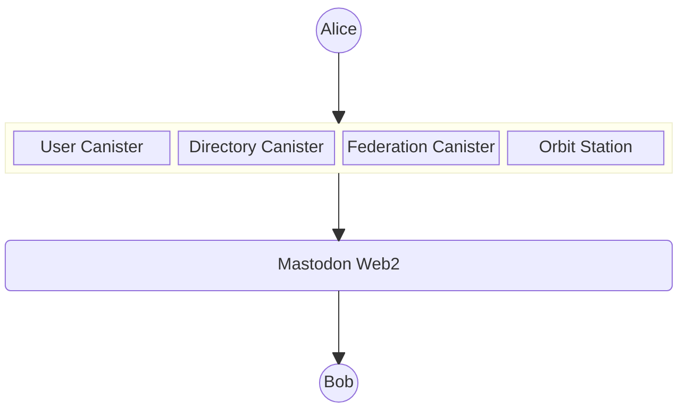
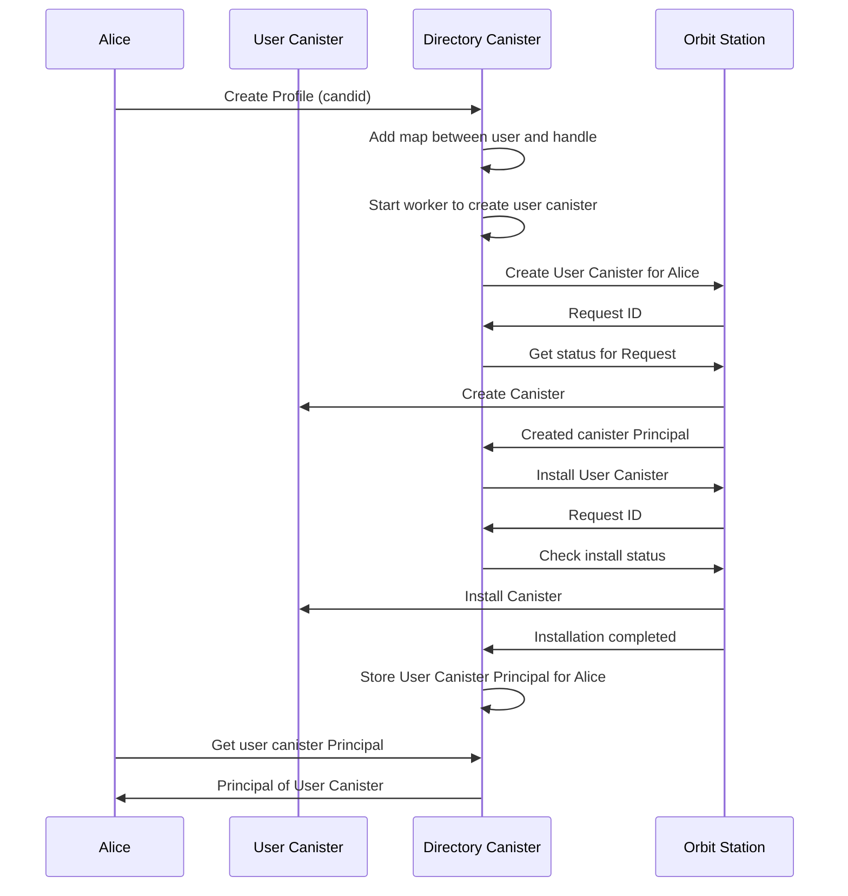
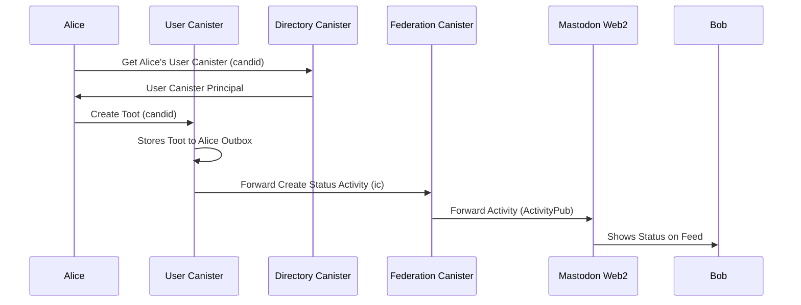

# Mastic Architecture Documentation

- [Mastic Architecture Documentation](#mastic-architecture-documentation)
  - [Scope](#scope)
  - [Architecture Overview](#architecture-overview)
  - [Flows](#flows)
    - [Create Profile](#create-profile)
    - [Create Status](#create-status)

## Scope

This document outlines the architecture of Mastic, with a focus on the core components and their interactions with the users and the Fediverse.

## Architecture Overview

## Flows

### Create Profile

### Create Status

