# Mastic Architecture Documentation

- [Mastic Architecture Documentation](#mastic-architecture-documentation)
  - [Scope](#scope)
  - [Architecture Overview](#architecture-overview)
  - [Flows](#flows)
    - [Create Profile](#create-profile)
    - [Sign In](#sign-in)
    - [Update Profile](#update-profile)
    - [Delete Profile](#delete-profile)
    - [Create Status](#create-status)
    - [Like Status](#like-status)
    - [Boost Status](#boost-status)
    - [Delete Status](#delete-status)
    - [Read Feed](#read-feed)
    - [Receive Updates from Fediverse](#receive-updates-from-fediverse)

## Scope

This document outlines the architecture of Mastic, with a focus on the core components and their interactions with the users and the Fediverse.

## Architecture Overview

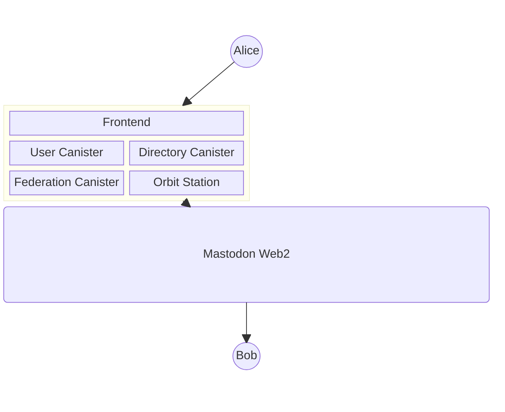

## Flows

### Create Profile

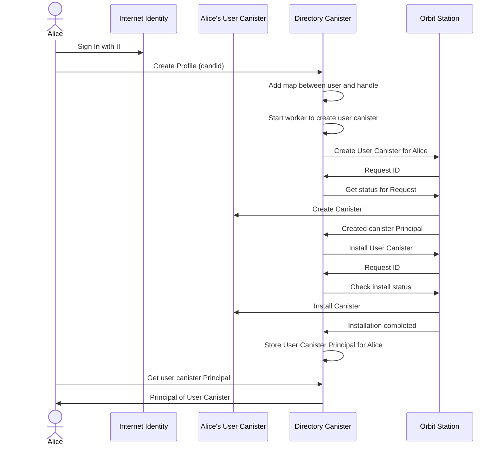

### Sign In

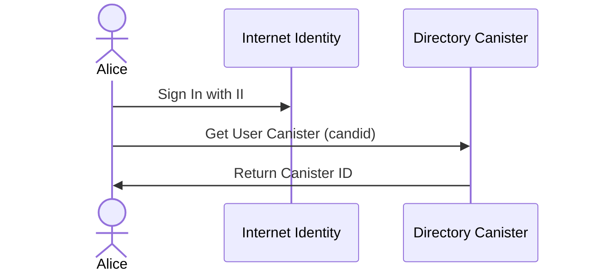

### Update Profile

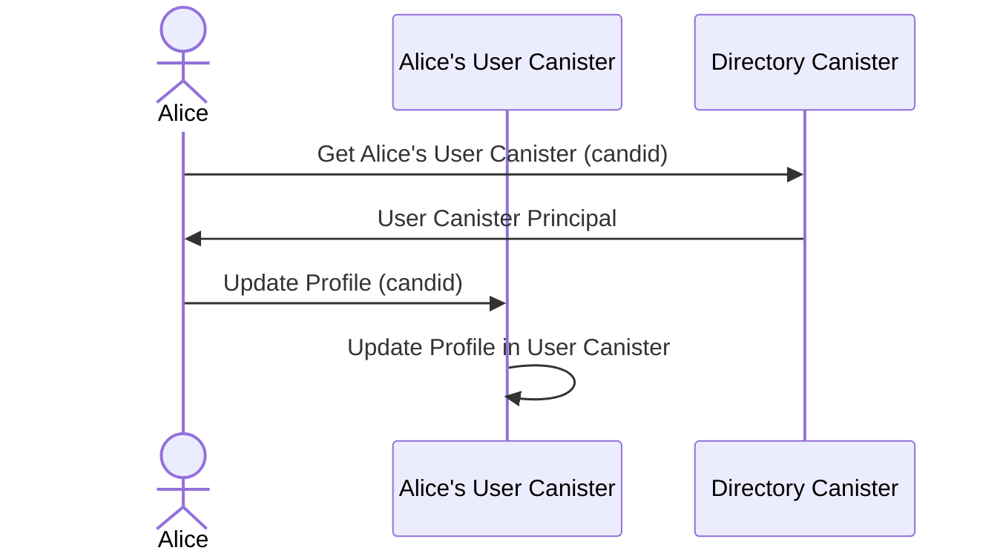

### Delete Profile

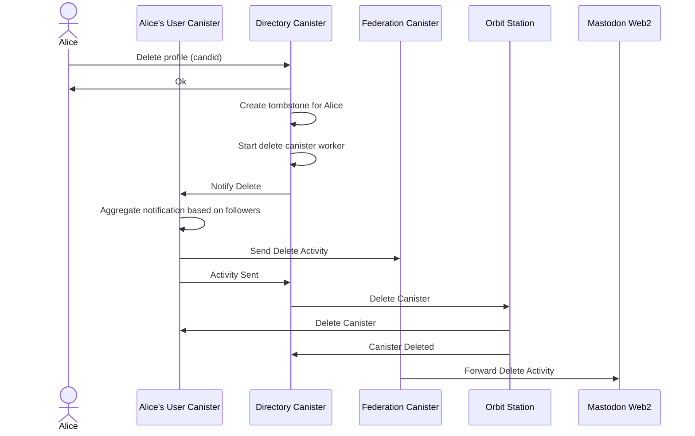

### Create Status

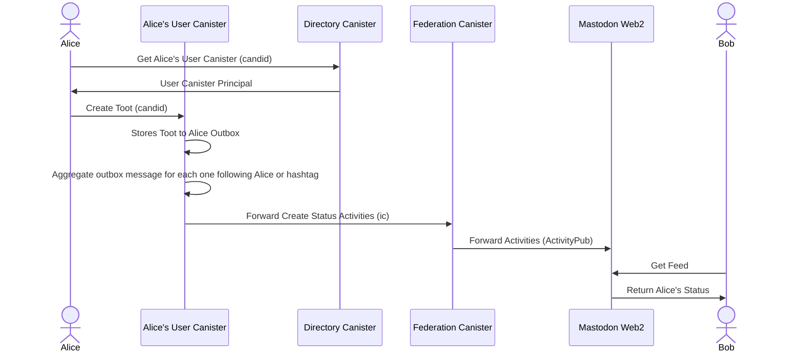

### Like Status

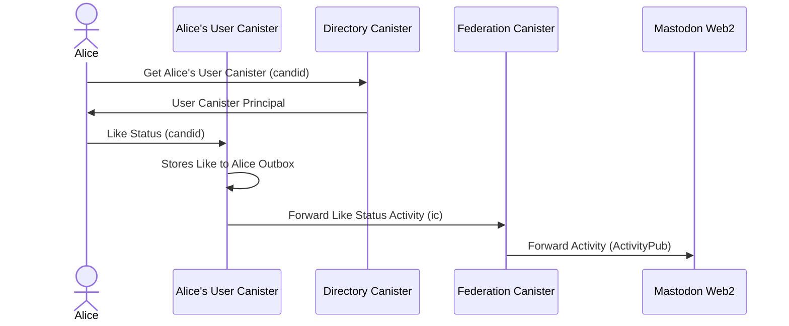

### Boost Status

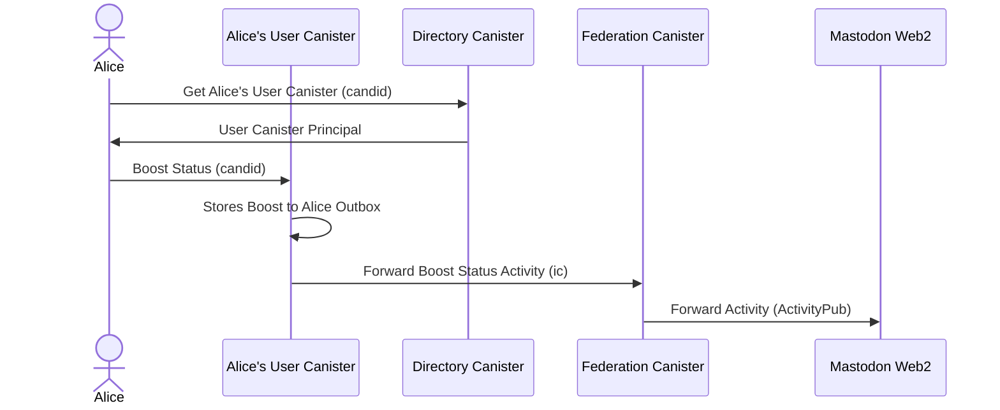

### Delete Status

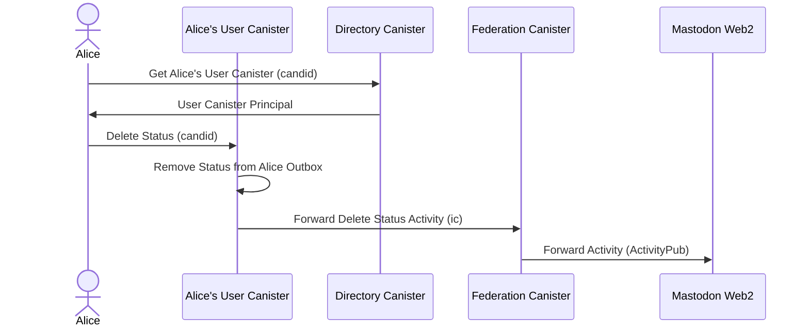

### Read Feed

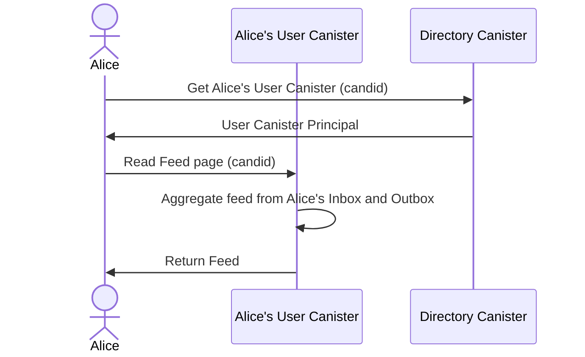

### Receive Updates from Fediverse

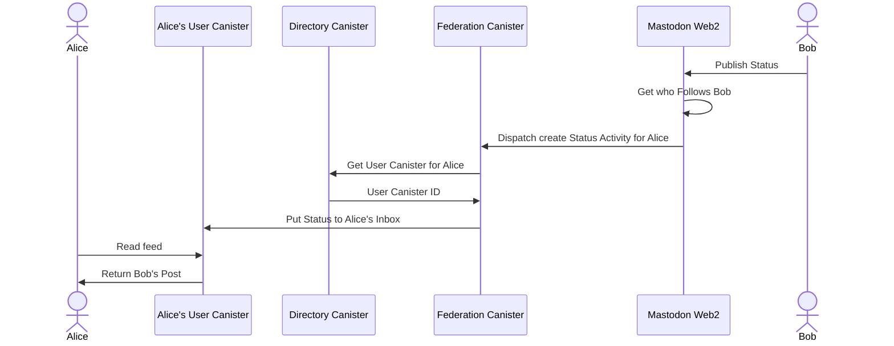
