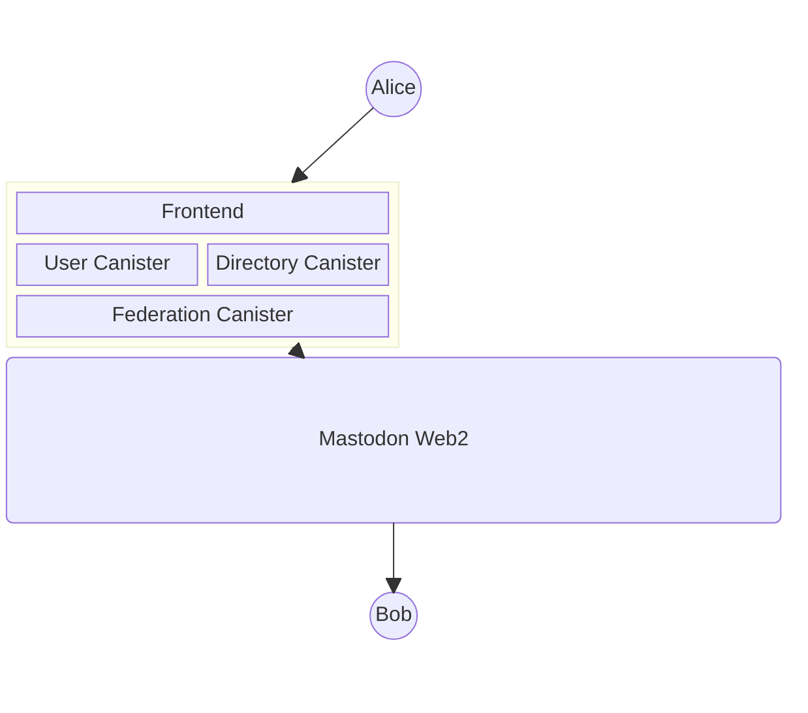
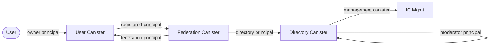

# Architecture

- [Architecture](#architecture)
  - [Overview](#overview)
  - [Directory Canister](#directory-canister)
    - [Directory Responsibilities](#directory-responsibilities)
    - [Directory Storage](#directory-storage)
    - [Directory Install Arguments](#directory-install-arguments)
  - [User Canister](#user-canister)
    - [User Canister Responsibilities](#user-canister-responsibilities)
    - [User Canister Storage](#user-canister-storage)
    - [User Canister Install Arguments](#user-canister-install-arguments)
    - [Custom Data Types](#custom-data-types)
  - [Federation Canister](#federation-canister)
    - [Federation Responsibilities](#federation-responsibilities)
    - [Federation Storage](#federation-storage)
    - [Federation Install Arguments](#federation-install-arguments)
  - [Authorization Model](#authorization-model)
  - [Inter-Canister Communication](#inter-canister-communication)
  - [Shared Libraries](#shared-libraries)

This document describes the architecture of Mastic, detailing
how each canister works internally, how they communicate with each other,
and how data flows through the system.

## Overview

Mastic is composed of three canister types and a frontend, all deployed
on the Internet Computer:

- **Directory Canister** -- Global singleton. User registry, canister
  lifecycle management, and moderation.
- **User Canister** -- One per user. Stores the user's profile, statuses,
  inbox, and social graph. Acts as the ActivityPub actor.
- **Federation Canister** -- Global singleton. HTTP boundary for all
  server-to-server ActivityPub traffic, WebFinger discovery, and activity
  routing.
- **Frontend** -- React asset canister providing the web UI and Internet
  Identity authentication.

## Directory Canister

The Directory Canister is the global entry point for Mastic. It maps
Internet Identity principals to handles and User Canister IDs, manages
the full canister lifecycle (creation and deletion), and enforces
moderation policies.

### Directory Responsibilities

- **User registry** -- maintains the `users` table mapping each principal
  to a handle and an optional User Canister ID.
- **Sign-up** -- on `sign_up`, validates the handle, inserts the user
  record, then spawns a worker that calls the IC management canister to
  create and install a new User Canister with the caller's principal as
  owner.
- **Sign-in** -- `whoami` and `user_canister` resolve the caller's
  principal to their handle and User Canister ID.
- **Profile deletion** -- creates a tombstone for the user, notifies the
  User Canister (which fans out a Delete activity), then destroys the
  canister via `stop_canister` + `delete_canister`.
- **Moderation** -- moderators (stored in the `moderators` table) can
  suspend users and manage the moderator list. The initial moderator is
  set at install time.
- **Profile search** -- `search_profiles` provides full-text lookup over
  registered handles.

### Directory Storage

Uses [wasm-dbms](https://github.com/veeso/wasm-dbms) for persistent
relational storage in stable memory. Tables are registered once during
`init` and survive upgrades without re-registration.

Three tables:

| Table        | Purpose                                        |
| :----------- | :--------------------------------------------- |
| `settings`   | Key-value configuration (federation canister)  |
| `moderators` | Moderator principals and creation timestamps   |
| `users`      | Principal-to-handle-to-canister mapping        |

See [Database Schema](./architecture/database-schema.md) for full column
definitions.

### Directory Install Arguments

Uses the `Init` / `Upgrade` enum variant pattern:

- **Init** -- requires `initial_moderator` (Principal),
  `federation_canister` (Principal), and `public_url` (String).
  Registers the database schema, seeds the first moderator, and stores
  the instance public URL.
- **Upgrade** -- empty variant. Validates that the caller did not
  accidentally pass `Init` args on upgrade.

## User Canister

Every Mastic user gets their own User Canister, created by the Directory
Canister during sign-up. The User Canister is the ActivityPub actor: it
owns the user's profile, statuses, social graph, and cryptographic
identity.

### User Canister Responsibilities

- **Profile management** -- single-row `profiles` table stores display
  name, bio, avatar, and header image. Updated via `update_profile`.
- **Status publishing** -- `publish_status` generates a
  [Snowflake ID](./specs/snowflake.md), persists the status in the
  `statuses` table, then sends a Create activity to the Federation
  Canister for fan-out.
- **Feed aggregation** -- `read_feed` merges the user's own statuses
  (outbox) with received activities (inbox) into a paginated,
  chronologically-sorted feed.
- **Social graph** -- `followers` and `following` tables track the
  user's relationships. Follow requests go through
  Pending/Accepted/Rejected states.
- **Inbox** -- `receive_activity` (called only by the Federation
  Canister) writes inbound ActivityPub activities into the `inbox` table.
- **Outbound activities** -- `follow_user`, `like_status`,
  `boost_status`, `block_user`, and their undo counterparts each send
  the corresponding ActivityPub activity to the Federation Canister via
  `send_activity`.
- **HTTP Signatures** -- stores an RSA key pair (public + private PEM)
  in settings, used by the Federation Canister to sign outbound HTTP
  requests on behalf of this actor.

### User Canister Storage

Uses [wasm-dbms](https://github.com/veeso/wasm-dbms), same as the
Directory Canister. Six tables:

| Table       | Purpose                                               |
| :---------- | :---------------------------------------------------- |
| `settings`  | Owner principal, federation canister, RSA key pair    |
| `profiles`  | Single-row profile (handle, display name, bio, etc.)  |
| `statuses`  | User's own statuses, keyed by Snowflake ID            |
| `inbox`     | Inbound ActivityPub activities                        |
| `followers` | Actor URIs of accounts following this user            |
| `following` | Actor URIs this user follows, with request status     |

See [Database Schema](./architecture/database-schema.md) for full column
definitions.

### User Canister Install Arguments

- **Init** -- requires `owner` (Principal), `federation_canister`
  (Principal), `handle` (String), and `public_url` (String). Registers
  the database schema and stores all values in settings.
- **Upgrade** -- empty variant.

### Custom Data Types

The User Canister defines three single-byte enum types for compact
database storage:

- **Visibility** -- `Public` (0), `Unlisted` (1), `FollowersOnly` (2),
  `Direct` (3). Controls status distribution scope.
- **ActivityType** -- 14 variants (`Create`, `Update`, `Delete`,
  `Follow`, `Accept`, `Reject`, `Like`, `Announce`, `Undo`, `Block`,
  `Add`, `Remove`, `Flag`, `Move`). Discriminates inbox activities.
- **FollowStatus** -- `Pending` (0), `Accepted` (1), `Rejected` (2).
  Tracks the lifecycle of follow requests.

## Federation Canister

The Federation Canister is the HTTP boundary of the Mastic node. It
handles all server-to-server ActivityPub communication: receiving
activities from remote Fediverse instances, sending activities out, and
serving WebFinger discovery and actor profiles.

### Federation Responsibilities

- **Inbound HTTP** -- `http_request` (query) and `http_request_update`
  (update) handle GET and POST requests from remote Fediverse instances.
  GET serves WebFinger, actor profiles, and collections. POST receives
  activities into user inboxes.
- **Outbound activities** -- `send_activity` (called by User Canisters)
  routes activities to their destinations. For local recipients, it
  resolves the target handle via the Directory Canister and calls
  `receive_activity` on the target User Canister. For remote recipients,
  it performs HTTPS outcalls with HTTP Signatures.
- **Activity buffering** -- during profile deletion, the Federation
  Canister buffers the Delete activity payload so it can still be served
  after the User Canister has been destroyed.
- **WebFinger** -- responds to
  `/.well-known/webfinger?resource=acct:user@domain` queries, enabling
  remote instances to discover Mastic actors.

### Federation Storage

Unlike the Directory and User canisters, the Federation Canister uses
`ic-stable-structures` directly (via `IcMemoryManager` with
`DefaultMemoryImpl`) rather than wasm-dbms. This is because the
Federation Canister primarily buffers transient data and does not need
a relational schema.

### Federation Install Arguments

- **Init** -- empty (no configuration fields required at install time).

## Authorization Model

Mastic uses principal-based authorization. Each canister checks the
caller's principal against an expected set configured at install time.

| Caller                | Target              | Trust Basis                                            |
| :-------------------- | :------------------ | :----------------------------------------------------- |
| User (browser)        | User Canister       | Caller matches owner principal set at install          |
| User Canister         | Federation Canister | User Canister registered by Directory at creation      |
| Federation Canister   | User Canister       | Federation principal set in User Canister install args |
| Moderator             | Directory Canister  | Caller present in `moderators` table                   |
| Directory Canister    | IC Management       | Controller of dynamically-created User Canisters       |

Anonymous principals are rejected by all authenticated endpoints.

## Inter-Canister Communication

All inter-canister calls use standard Candid-encoded `ic_cdk::call`
invocations. The key communication patterns are:

1. **Activity fan-out** -- User Canister calls `send_activity` on the
   Federation Canister. Federation resolves recipients (local via
   Directory, remote via HTTPS outcalls) and delivers to each inbox.
2. **Activity delivery** -- Federation Canister calls
   `receive_activity` on target User Canisters to deposit inbound
   activities.
3. **Handle resolution** -- Federation Canister calls the Directory
   Canister to resolve actor handles to User Canister principals.
4. **Canister lifecycle** -- Directory Canister calls the IC management
   canister (`create_canister`, `install_code`, `stop_canister`,
   `delete_canister`) to manage User Canister instances.

## Shared Libraries

Four workspace crates provide shared functionality:

- **did** (`crates/libs/did`) -- Candid type definitions shared across
  all canisters. Defines request/response types, `UserProfile`,
  `Status`, `Visibility`, and install argument enums.
- **db-utils** (`crates/libs/db-utils`) -- Database utilities including
  `HandleSanitizer`, `HandleValidator`, and the `Settings` key-value
  abstraction used by Directory and User canisters.
- **ic-utils** (`crates/libs/ic-utils`) -- Test-friendly wrappers around
  IC APIs: `caller()`, `now()`, `trap()`. In unit tests these return
  dummy values instead of calling `ic_cdk`.
- **activitypub** (`crates/libs/activitypub`) -- W3C ActivityStreams 2.0
  and ActivityPub protocol types: `Activity`, `Actor`, `Object`,
  `PublicKey`, `WebFingerResponse`, collection types, and Mastodon
  extensions.
