# Flows

This page documents the sequence diagrams for all major Mastic flows.
Each flow maps to one or more [user stories](../project.md#user-stories)
defined in the project specification.

## Create Profile

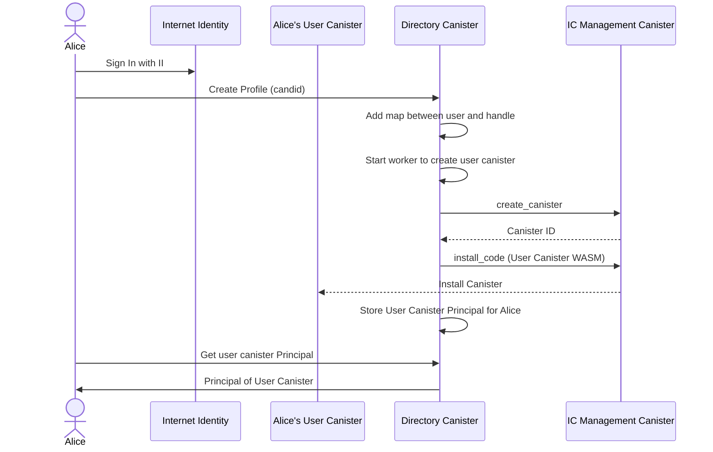

## Sign In

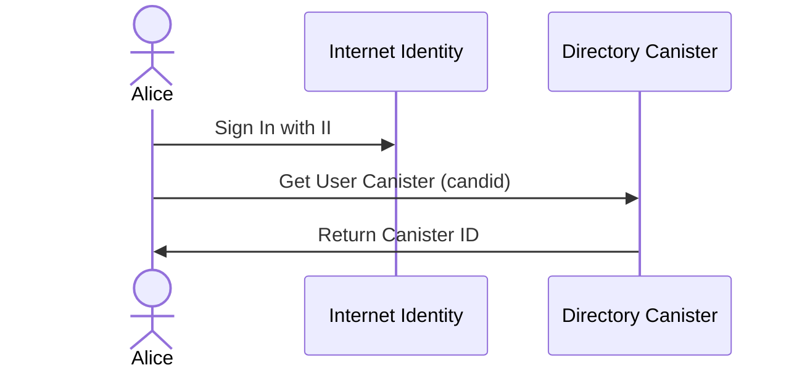

## Update Profile

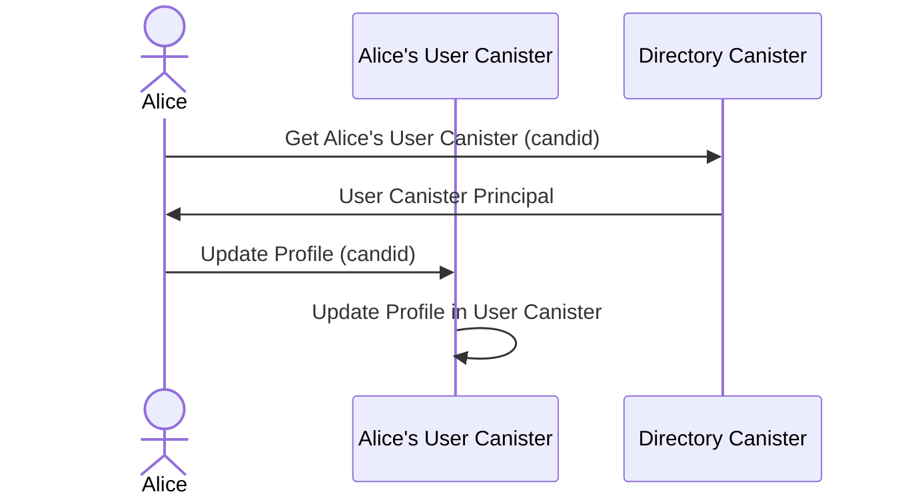

## Delete Profile

> **Note:** The Federation Canister must buffer the Delete activity data
> before the User Canister is destroyed, since the User Canister will no
> longer exist to serve actor profile requests after deletion.

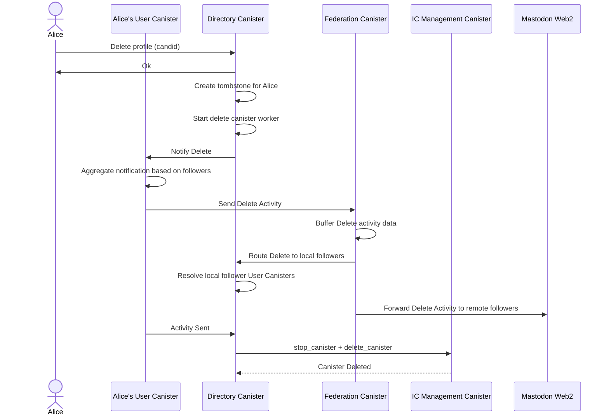

## Follow User

The follow lifecycle has three phases: **request**, **pending**, and
**accept/reject**. Alice sends a follow request; Bob's canister stores
it as a pending follow request; Bob reviews pending requests and
accepts or rejects each one.

### Send follow request (local)

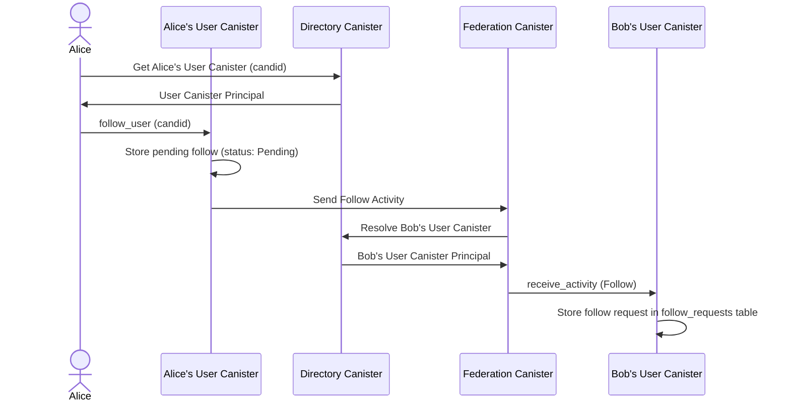

### Send follow request (remote)

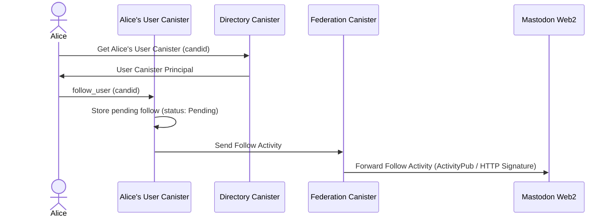

### Accept follow request (local)

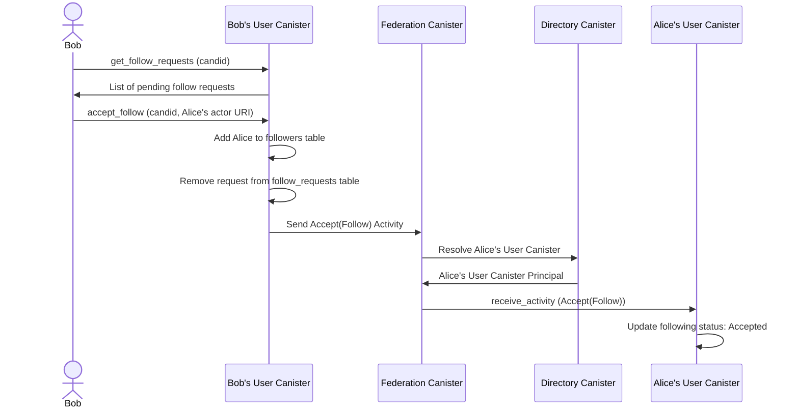

### Accept follow request (remote target accepts)

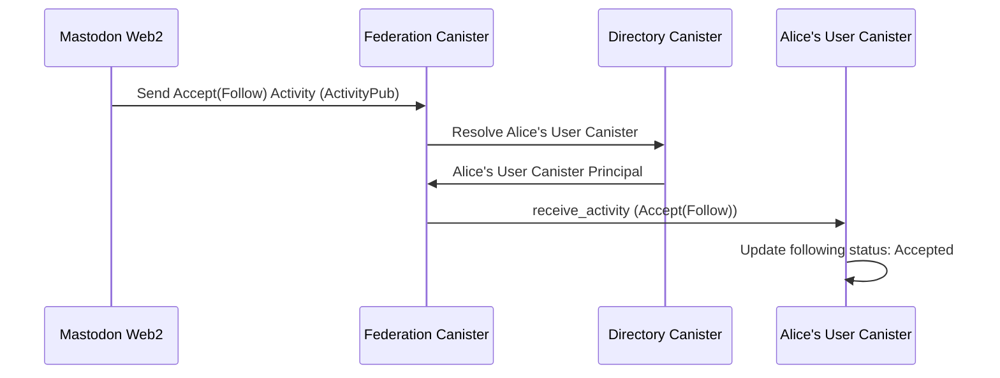

### Reject follow request (local)

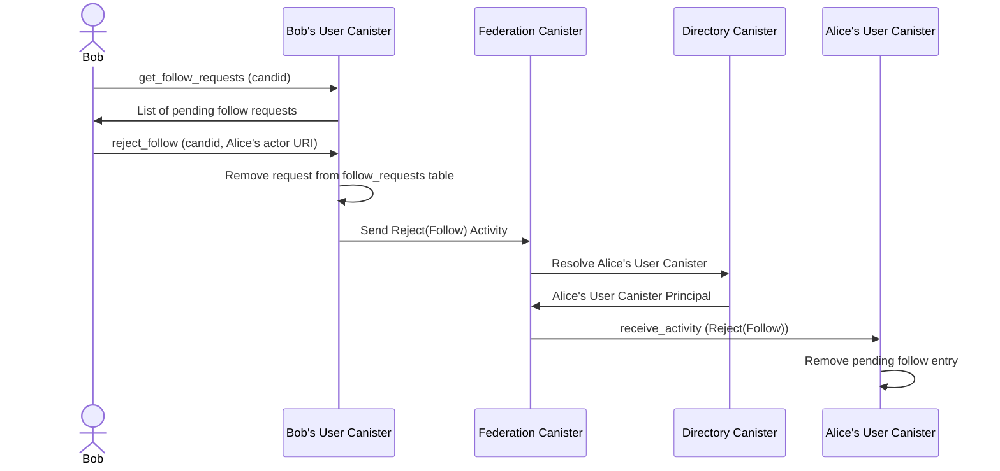

### Reject follow request (remote target rejects)

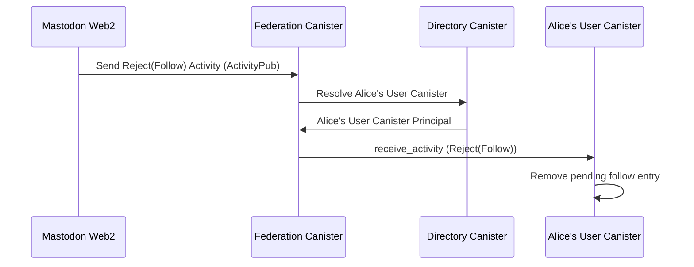

## Unfollow User

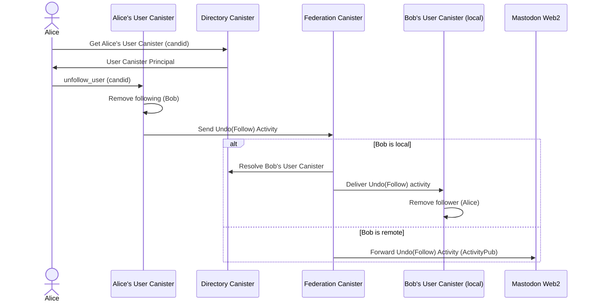

## Block User

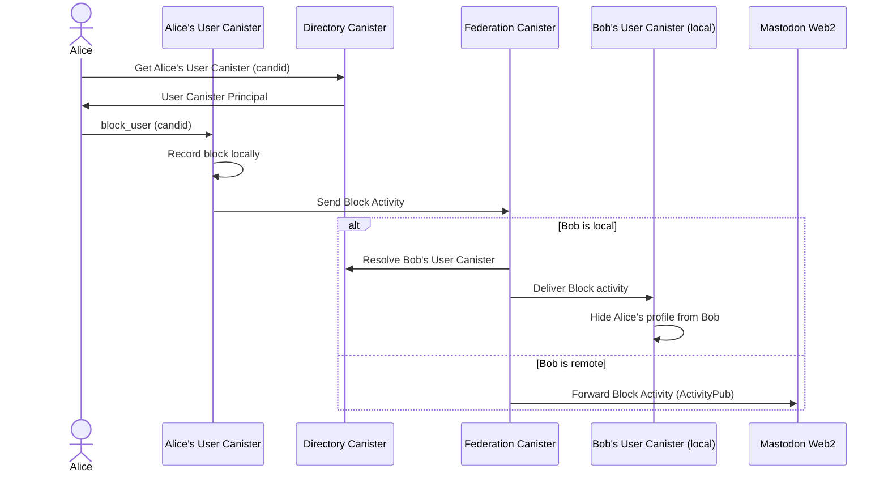

## Create Status

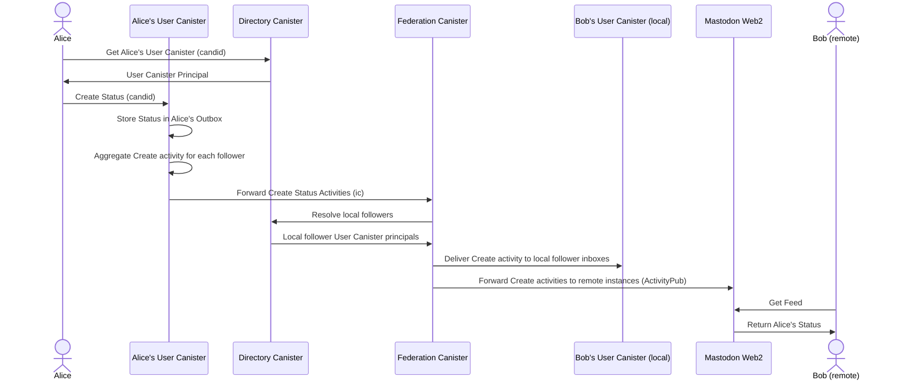

## Like Status

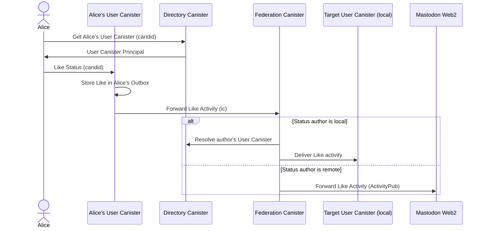

## Boost Status

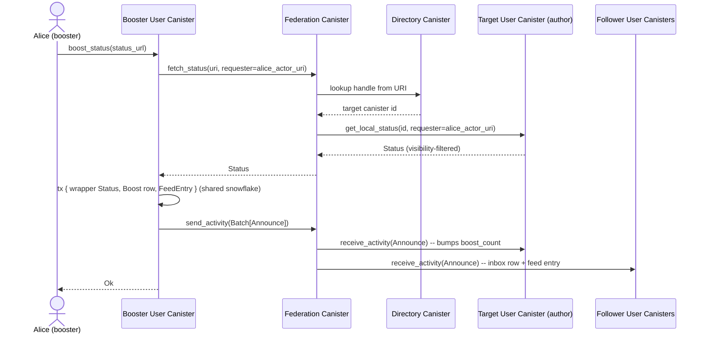

The booster's User Canister never trusts boost content from its caller:
the wrapper row's `content`, `spoiler_text`, and `sensitive` are
populated from the `Status` returned by `Federation.fetch_status`,
which in turn dereferences the local author through
`User.get_local_status` (Milestone 1; Milestone 3 will extend the
remote branch via HTTPS outcalls).

A single Snowflake is reused as `boosts.id`, the wrapper `statuses.id`,
the `feed.id` for the booster's outbox entry, and the `Announce`
activity `id` (`<own_actor_uri>/statuses/<snowflake>`).

`boost_status` is **idempotent**: a duplicate boost of the same
`status_url` returns `Ok` without inserting a second wrapper or
re-emitting the `Announce`. `undo_boost` reverses the flow — it deletes
the `boosts` row, the wrapper `statuses` row, and the `feed` outbox
entry, then dispatches an `Undo(Announce)` to followers and the
original author. `undo_boost` is also idempotent.

Remote author / follower delivery via HTTPS is Milestone 3.

## Delete Status

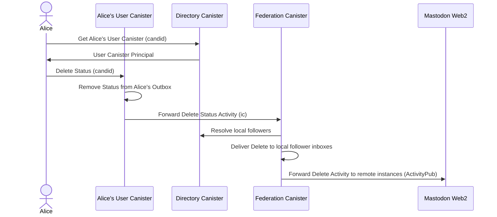

## Read Feed

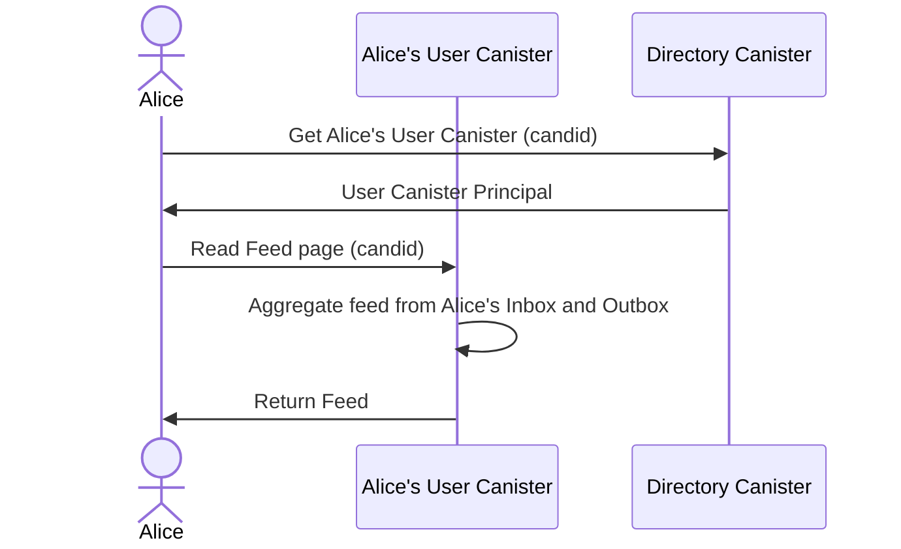

## Receive Updates from Fediverse

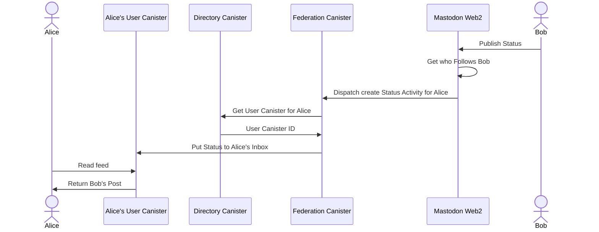
